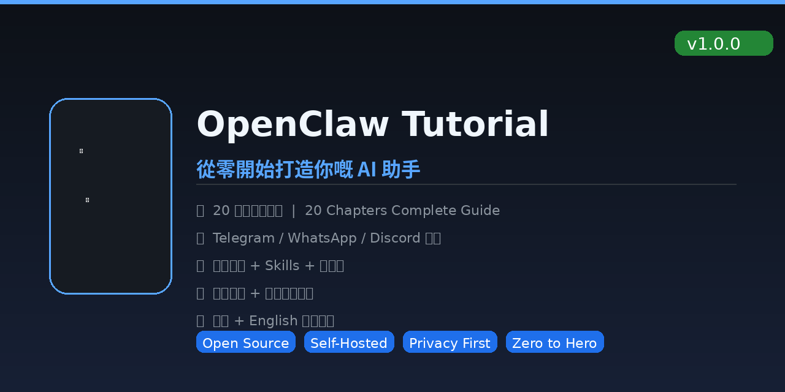

# OpenClaw Tutorial 🐾



> **從零開始打造你的 AI 助手 | From Zero to Hero with OpenClaw**

一個完整的 OpenClaw 教學項目，由安裝到進階全攻略，中英雙語對照。

---

## 🇹🇼 中文版

**5 個部分，20 個章節，涵蓋你需要知道的一切：**

| 部分 | 章節 | 內容 |
|------|------|------|
| Part 1 | Ch.1-3 | 入門（OpenClaw 是什麼、為什麼用它、基礎設定） |
| Part 2 | Ch.4-6 | 通訊連接（Telegram、WhatsApp、Discord） |
| Part 3 | Ch.7-11 | 進階功能（其他平台、Agent 深入、Session、記憶、Skills） |
| Part 4 | Ch.12-15 | 工具與自動化（執行工具、Cron、手機節點、安全權限） |
| Part 5 | Ch.16-20 | 系統管理（Web Console、進階設定、部署、疑難排解、實戰案例） |

📄 檔案：[`part1.md`](part1.md) ~ [`part5.md`](part5.md)

## 什麼是 OpenClaw？

OpenClaw 是一個開源的 AI 助手框架，可以連接你日常使用的通訊平台（Telegram、WhatsApp、Discord），自動處理你的工作流程，同時保護你的私隱。

**重點功能：**
- 🔗 **多平台連接** — Telegram / WhatsApp / Discord / iMessage / Signal / Slack
- 🧠 **長期記憶** — 不會忘記你教過它的東西
- 🛠️ **工具整合** — 執行命令、瀏覽網頁、操作文件
- ⏰ **自動化** — Heartbeat、Cron Jobs、Webhook
- 🔒 **私隱優先** — Self-hosted，你的數據你做主
- 📱 **手機節點** — 相機、GPS、語音

## 快速開始

```bash
# 安裝
npm install -g openclaw

# 啟動
openclaw gateway start

# 連接 Telegram
openclaw channel add telegram
```

## 相關資源

- [OpenClaw 官方文檔](https://docs.openclaw.ai)
- [GitHub 原始碼](https://github.com/openclaw/openclaw)
- [ClawHub Skills 市集](https://clawhub.ai)
- [Discord 社群](https://discord.com/invite/clawd)
