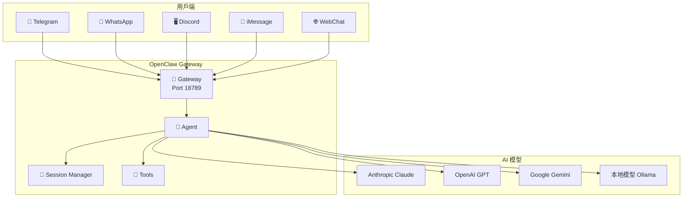
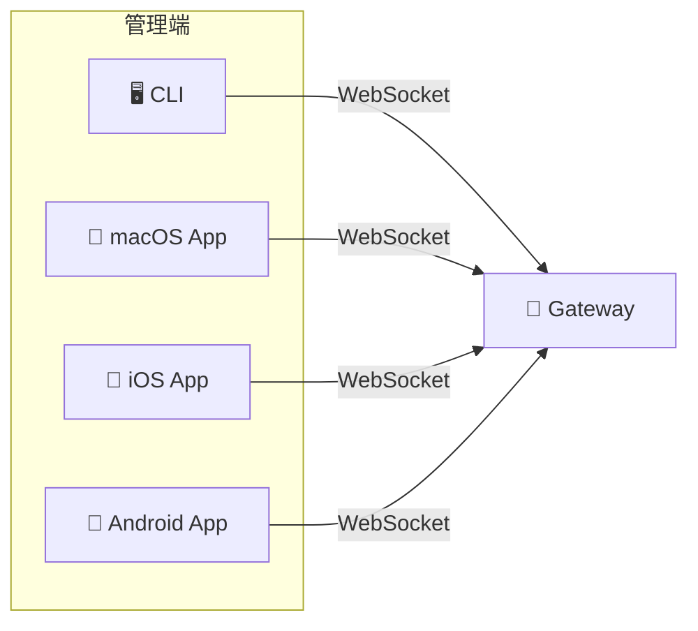

# OpenClaw 保姆級教程 🦞 — 從零開始打造你嘅 AI 助手

> **版本：** 2026.3.28 ｜ **作者：** 阿星 ⭐ ｜ **語言：** 繁體中文（香港風格）

---

## 前言

你好！歡迎嚟到 OpenClaw 保姆級教程。

你有冇試過諗：「如果我可以喺 WhatsApp / Telegram / Discord 直接同 AI 傾偈，幾好呢？」OpenClaw 就係為咗呢件事而生 — 佢係一個 **self-hosted** 嘅 AI agent gateway，幫你將各種聊天軟件同 AI 模型連埋一齊。

### 呢份教程適合邊個？

- ✅ 想自建 AI 助手嘅開發者 / 技術愛好者
- ✅ 想喺 Telegram / WhatsApp / Discord 用 AI 嘅人
- ✅ 想控制自己數據、唔想依賴第三方服務嘅人
- ✅ 對 Node.js 有基本認識嘅人

### 你需要啲乜嘢？

| 項目 | 說明 |
|------|------|
| 💻 一部電腦 / 伺服器 | Linux、macOS 或 Windows 都得 |
| 🌐 穩定嘅網絡 | 建議 VPS 或者 always-on 嘅機器 |
| 🔑 AI 模型 API Key | 至少一個：Anthropic、OpenAI、Google 等 |
| 📱 聊天軟件帳號 | Telegram / WhatsApp / Discord 等 |
| ⏱️ 大約 30-60 分鐘 | 跟住教程一步步做 |

### 教程結構

呢份教程分為兩大部分：

- **Part 1（呢份）**：前言 → 認識 → 安裝 → 模型設定 → Telegram → WhatsApp → Discord
- **Part 2（下一份）**：進階功能 → 安全 → 自訂 Agent → 常見問題

準備好未？我哋開始！🚀

---

## 第一章：認識 OpenClaw

### 1.1 OpenClaw 係乜嘢？

OpenClaw（🦞）係一個 **開源（MIT License）** 嘅 self-hosted AI agent gateway。

簡單啲講，佢做三件事：

1. **連接聊天軟件** — WhatsApp、Telegram、Discord、iMessage、Signal、Slack、Google Chat 等等
2. **連接 AI 模型** — Anthropic Claude、OpenAI GPT、Google Gemini、OpenRouter 等 35+ 個 provider
3. **管理對話** — Session、記憶、權限、安全，全部由 Gateway 統一處理

> 💡 **一句話總結：** OpenClaw 係一個中間人，幫你嘅聊天軟件同 AI 模型「做媒」。

```
你 (WhatsApp/Telegram/Discord) ←→ OpenClaw Gateway ←→ AI 模型 (Claude/GPT/Gemini)
```

[截圖：OpenClaw Dashboard 主頁面]

### 1.2 OpenClaw vs 其他 AI 工具

你可能會問：「市面上已經有好多 AI 聊天工具，點解要用 OpenClaw？」

| 功能 | OpenClaw | ChatGPT | 自建 Telegram Bot |
|------|----------|---------|-------------------|
| 多平台支援 | ✅ 8+ 平台 | ❌ 只有自家 App | ❌ 只有 Telegram |
| Self-hosted | ✅ 你嘅伺服器 | ❌ 雲端服務 | ✅ |
| 模型自由選擇 | ✅ 35+ provider | ❌ 只用 GPT | ⚠️ 要自己寫 |
| 群組支援 | ✅ 內建 | ❌ | ⚠️ 要自己寫 |
| 權限管理 | ✅ 內建 | ❌ | ⚠️ 要自己寫 |
| 開源 | ✅ MIT | ❌ | 取決於你 |
| 難度 | 🟢 中等 | 🟢 簡單 | 🔴 困難 |

**OpenClaw 嘅優勢：**
- 一個 Gateway 管理所有平台，唔使每個平台寫一次 code
- 自己控制數據，唔使擔心私隱
- 開源免費，社區活躍

### 1.3 核心概念

喺開始之前，我哋要搞清楚四個核心概念：

#### 🔌 Gateway（閘道器）

Gateway 係 OpenClaw 嘅 **核心引擎**。佢負責：

- 管理所有聊天平台嘅連接
- 收發訊息
- 管理 AI 模型嘅調用
- 提供 Web UI（Dashboard）

默認運行喺 `http://127.0.0.1:18789/`。

#### 🤖 Agent（代理）

Agent 係你嘅 AI 助手本身。佢負責：

- 理解用戶嘅訊息
- 決定點樣回覆
- 使用工具（web search、file read 等）
- 管理記憶

你可以設定唔同 Agent 嘅行為、模型、工具權限等。

#### 📡 Channel（頻道）

Channel 係 Gateway 同聊天軟件之間嘅 **連接通道**。每個聊天平台就係一個 Channel：

- `telegram` — Telegram Bot
- `whatsapp` — WhatsApp Web
- `discord` — Discord Bot
- `signal` — Signal
- 等等

#### 💬 Session（對話 Session）

每次有人同你嘅 AI 助手傾偈，就會產生一個 Session。Session 管理：

- 對話歷史
- 上下文（context）
- 用戶身份

> 💡 **一個簡單比喻：**
> - **Gateway** = 酒樓經理
> - **Agent** = 樓面部長（負責招呼客人）
> - **Channel** = 唔同嘅入口（正門、側門、後門）
> - **Session** = 一張枱（客人坐低傾偈）

### 1.4 架構圖解

OpenClaw 嘅整體架構如下：



**數據流向：**

1. 用戶喺 Telegram 發送訊息
2. Telegram API 將訊息送到 OpenClaw Gateway
3. Gateway 找到對應嘅 Agent 同 Session
4. Agent 將訊息 + 歷史上下文送去 AI 模型
5. AI 模型回覆，Agent 處理後通過 Gateway 送返 Telegram
6. 用戶收到 AI 回覆

**Clients 連接（你管理用）：**



### 第一章小結

- OpenClaw 係一個 self-hosted 嘅 AI agent gateway，開源免費
- 核心四概念：**Gateway**（引擎）、**Agent**（助手）、**Channel**（連接）、**Session**（對話）
- 支援 8+ 聊天平台同 35+ AI 模型 provider
- 數據喺自己手上，私隱有保障

---

## 第二章：安裝 OpenClaw

### 2.1 系統要求

開始安裝之前，先檢查你嘅環境：

| 項目 | 最低要求 | 建議 |
|------|----------|------|
| 作業系統 | Linux / macOS / Windows | Linux (Ubuntu/Debian) |
| Node.js | v22.14+ | v24（推薦） |
| 記憶體 | 512MB | 1GB+ |
| 硬碟空間 | 500MB | 1GB+ |
| 網絡 | 穩定連線 | 公網 IP / VPS |

> ⚠️ **注意：** 如果你想 WhatsApp 或其他平台能夠 24/7 收到訊息，建議用 VPS 或者一部永遠開住嘅機器。

### 2.2 安裝 Node.js

OpenClaw 需要 Node.js v22.14 以上。以下係各平台嘅安裝方法：

#### Linux (Ubuntu/Debian)

```bash
# 方法一：用 nvm（推薦，方便切換版本）
curl -o- https://raw.githubusercontent.com/nvm-sh/nvm/v0.40.0/install.sh | bash
source ~/.bashrc
nvm install 24
nvm use 24

# 驗證
node -v   # 應該顯示 v24.x.x
npm -v    # 應該顯示 11.x.x
```

```bash
# 方法二：用 NodeSource（適合伺服器環境）
curl -fsSL https://deb.nodesource.com/setup_24.x | sudo bash -
sudo apt-get install -y nodejs
```

#### macOS

```bash
# 方法一：用 nvm（推薦）
curl -o- https://raw.githubusercontent.com/nvm-sh/nvm/v0.40.0/install.sh | bash
source ~/.zshrc
nvm install 24

# 方法二：用 Homebrew
brew install node@24
```

#### Windows

```powershell
# 方法一：用 nvm-windows
# 去 https://github.com/coreybutler/nvm-windows/releases 下載安裝檔
nvm install 24
nvm use 24

# 方法二：直接下載 Node.js 安裝檔
# 去 https://nodejs.org 下載 LTS 版本
```

[截圖：node -v 同 npm -v 嘅終端輸出]

#### ✅ 驗證 Node.js 安裝

```bash
node -v   # 預期：v24.x.x 或 v22.x.x
npm -v    # 預期：10.x.x 或 11.x.x
```

> 💡 **Tips：** 如果你見到 `command not found`，試下重新開個 terminal 或者 run `source ~/.bashrc`。

### 2.3 安裝 OpenClaw

Node.js 搞掂之後，安裝 OpenClaw 就好簡單。

#### 方法一：一鍵安裝腳本（推薦）

**Linux / macOS：**

```bash
curl -fsSL https://openclaw.ai/install.sh | bash
```

**Windows（PowerShell，以管理員身份執行）：**

```powershell
iwr -useb https://openclaw.ai/install.ps1 | iex
```

呢個腳本會自動：
1. 檢查 Node.js 版本
2. 安裝 OpenClaw CLI
3. 設定基本配置

#### 方法二：用 npm 手動安裝

```bash
npm install -g openclaw@latest
```

#### ✅ 驗證安裝

```bash
openclaw --version
# 預期輸出：2026.3.28 或更新版本

openclaw doctor
# 檢查環境係咪齊全
```

[截圖：openclaw --version 同 openclaw doctor 嘅輸出]

> 💡 **Tips：** 如果 `openclaw` command 找不到，檢查下你嘅 PATH 有冇包含 npm global 目錄：
> ```bash
> npm config get prefix
> # 確認呢個路徑喺你嘅 $PATH 入面
> ```

### 2.4 初始設定（onboard）

安裝好之後，執行 onboard 嚮導做初始設定：

```bash
openclaw onboard --install-daemon
```

呢個嚮導會引導你：

1. **選擇 AI 模型提供商** — 選你想用嘅 provider（Anthropic / OpenAI / Google 等）
2. **輸入 API Key** — 你嘅模型 API key
3. **設定 Gateway** — 端口、host 等基本配置
4. **安裝 Daemon** — 將 OpenClaw 安裝為系統服務

[截圖：onboard 嚮導嘅交互介面]

跟住嚮導嘅提示一步步做就得。如果你暫時唔想設定某個平台，可以 skip 住，之後再加。

#### 手動設定（進階用戶）

如果你想手動設定，配置文件喺 `~/.openclaw/openclaw.json`（JSON5 格式），基本結構如下：

```json5
{
  // OpenClaw 配置文件
  // 格式：JSON5（支援 comments、trailing commas）

  agents: {
    defaults: {
      model: {
        primary: "anthropic/claude-sonnet-4-6",
        fallbacks: ["openai/gpt-5.2"],
      },
    },
  },

  channels: {
    // 之後會喺呢度加 telegram、whatsapp、discord 等配置
  },
}
```

### 2.5 安裝為系統服務

如果你想 OpenClaw 開機自動啟動（強烈建議），安裝為系統服務：

#### Linux (systemd)

```bash
# onboard 嚮導會自動做呢步
# 如果要手動：
openclaw gateway install

# 啟動服務
sudo systemctl start openclaw-gateway
sudo systemctl enable openclaw-gateway

# 查看狀態
sudo systemctl status openclaw-gateway
```

#### macOS (launchd)

```bash
openclaw gateway install
# 會自動建立 LaunchAgent
```

#### 或者用 OpenClaw 嘅快捷命令

```bash
# 查看 Gateway 狀態
openclaw gateway status

# 啟動 Gateway
openclaw gateway start

# 停止 Gateway
openclaw gateway stop

# 重啟 Gateway
openclaw gateway restart
```

[截圖：openclaw gateway status 嘅輸出]

### 2.6 驗證安裝成功

完成以上步驟之後，做個全面檢查：

```bash
# 1. 檢查版本
openclaw --version

# 2. 執行 Doctor 診斷
openclaw doctor

# 3. 檢查 Gateway 狀態
openclaw gateway status

# 4. 開啟 Dashboard
openclaw dashboard
# 瀏覽器會自動打開 http://127.0.0.1:18789/
```

如果 `openclaw doctor` 全部 ✅，就代表安裝成功！

[截圖：Dashboard 主頁面同 Doctor 診斷結果]

> 💡 **Tips：**
> - 如果 Doctor 發現問題，試下 `openclaw doctor --fix` 自動修復
> - 如果 Gateway 起唔到，檢查下端口 18789 有冇被佔用：`lsof -i :18789`
> - 防火牆記得開放 18789 端口（如果想遠端訪問 Dashboard）

### 第二章小結

- 安裝順序：**Node.js → OpenClaw → onboard → 安裝服務 → 驗證**
- 推薦用一鍵安裝腳本，最快最簡單
- `openclaw doctor` 係你嘅好朋友，有問題先 run 佢
- 記得安裝為系統服務，確保 Gateway 開機自動啟動

---

## 第三章：AI 模型提供商設定

OpenClaw 支援超過 35 個 AI 模型 provider，你可以自由選擇同混合使用。

### 3.1 常見提供商介紹

| Provider | 模型例子 | 特色 | 定價 |
|----------|----------|------|------|
| **Anthropic** | Claude Sonnet, Claude Opus | 長上下文、安全 | 中高 |
| **OpenAI** | GPT-5.2, GPT-4o | 萬能型、生態完善 | 中高 |
| **Google** | Gemini 2.5 Pro | 多模態、性價比 | 中 |
| **OpenRouter** | 聚合 100+ 模型 | 一個 API 用多個模型 | 浮動 |
| **Ollama** | Llama, Mistral 等 | 本地運行、免費 | 免費 |

模型嘅格式係 `provider/model`，例如：
- `anthropic/claude-sonnet-4-6`
- `openai/gpt-5.2`
- `google/gemini-2.5-pro`
- `openrouter/anthropic/claude-sonnet-4-6`

### 3.2 點樣揀模型

揀模型嘅考量因素：

| 用途 | 推薦模型 | 原因 |
|------|----------|------|
| 日常聊天 | Claude Sonnet / GPT-4o | 回應快、質素好 |
| 複雜推理 | Claude Opus / GPT-5.2 | 推理能力強 |
| 平價之選 | Gemini Flash / OpenRouter | 便宜、夠用 |
| 私隱敏感 | Ollama 本地模型 | 數據唔出機器 |
| 編程 | Claude Sonnet / GPT-5.2 | 代碼質素高 |

> 💡 **建議新手：** 先用一個模型就好，例如 `anthropic/claude-sonnet-4-6`。穩定之後再加 fallback 同其他 provider。

### 3.3 API Key 設定

每個 provider 需要對應嘅 API Key。以下係各 provider 嘅取得方法：

#### Anthropic

1. 去 [console.anthropic.com](https://console.anthropic.com)
2. 註冊 / 登入
3. Settings → API Keys → Create Key
4. 複製 Key（格式：`sk-ant-...`）

#### OpenAI

1. 去 [platform.openai.com](https://platform.openai.com)
2. 註冊 / 登入
3. API Keys → Create new secret key
4. 複製 Key（格式：`sk-...`）

#### Google (Gemini)

1. 去 [aistudio.google.com](https://aistudio.google.com)
2. Get API Key → Create Key
3. 複製 Key

#### 設定方式

有兩種方法設定 API Key：

**方法一：環境變數（推薦）**

```bash
# 加到 ~/.bashrc 或 ~/.zshrc
export ANTHROPIC_API_KEY="sk-ant-your-key-here"
export OPENAI_API_KEY="sk-your-key-here"
export GEMINI_API_KEY="your-key-here"
```

**方法二：配置文件**

```json5
{
  providers: {
    anthropic: {
      apiKey: "sk-ant-your-key-here",
    },
    openai: {
      apiKey: "sk-your-key-here",
    },
  },
}
```

> ⚠️ **安全提示：** API Key 等同密碼，千萬唔好上傳到 GitHub 或者公開場所。用環境變數係最安全嘅做法。

### 3.4 模型 Failover 配置

Failover 係指：當主要模型用唔到（API down、額度用完等），自動切換到備用模型。

```json5
{
  agents: {
    defaults: {
      model: {
        // 主要模型
        primary: "anthropic/claude-sonnet-4-6",
        // 備用模型（按順序嘗試）
        fallbacks: [
          "openai/gpt-5.2",
          "google/gemini-2.5-pro",
        ],
      },
    },
  },
}
```

**運作原理：**

1. 先用 `primary` 模型
2. 如果 primary 出錯（429 rate limit、500 server error 等）
3. 自動切換到 `fallbacks[0]`
4. 如果 fallbacks[0] 都出錯，試 `fallbacks[1]`
5. 全部都 fail 先回傳錯誤

> 💡 **Tips：** 建議至少設定一個 fallback model，特別係如果你用嘅係經常有 rate limit 嘅 provider。

### 3.5 本地模型（Ollama）

如果你注重私隱或者想慳錢，可以用 Ollama 跑本地模型。

#### 安裝 Ollama

```bash
# Linux / macOS
curl -fsSL https://ollama.ai/install.sh | bash

# 下載一個模型（例如 Llama 3.1）
ollama pull llama3.1

# 確認 Ollama 運行中
ollama list
```

#### 在 OpenClaw 設定 Ollama

```json5
{
  providers: {
    ollama: {
      baseUrl: "http://localhost:11434",
    },
  },
  agents: {
    defaults: {
      model: {
        primary: "ollama/llama3.1",
      },
    },
  },
}
```

> ⚠️ **注意：** 本地模型需要較好嘅硬件。建議至少 16GB RAM 跑 7B 模型，32GB+ 跑 13B+ 模型。

### 第三章小結

- 模型格式：`provider/model`（如 `anthropic/claude-sonnet-4-6`）
- API Key 建議用環境變數，安全過寫喺配置文件
- 設定 fallback 模型可以防止 API 當機影響服務
- 本地模型（Ollama）適合注重私隱或者想慳錢嘅用戶

---

